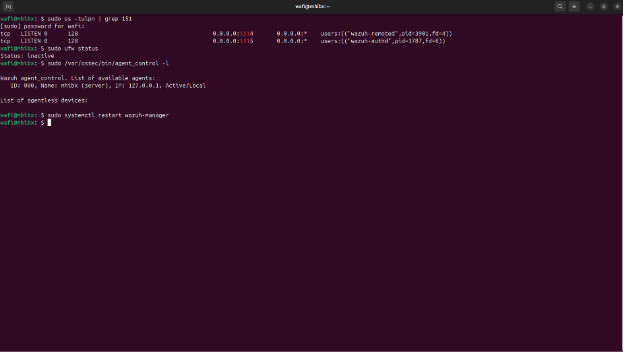
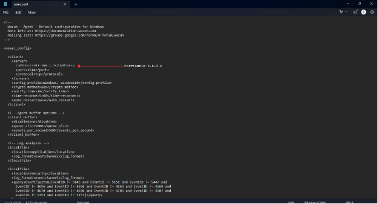
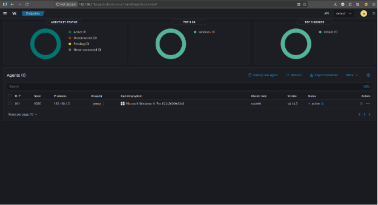

# Windows Agent Deployment

## Objective

Connect a Windows endpoint to the Wazuh Manager and verify that the endpoint can successfully send security telemetry to the SIEM.

## Installation

The Windows agent installer was generated from the Wazuh Dashboard and installed on the Windows endpoint.


## Initial Problem

After installation, the agent did not appear as active in the Wazuh Dashboard.

The issue was investigated by checking the network connection, firewall configuration, agent configuration, and Wazuh Agent service.

## Troubleshooting

The following areas were checked:

- Network connectivity
- Wazuh communication ports
- Windows Firewall configuration
- Agent configuration
- Wazuh Agent service status





## Root Cause

The Wazuh Agent was configured with an incorrect Manager address:

```text
0.0.0.0
```

The configuration was corrected to the actual Wazuh Manager address:

```text
192.168.1.7
```

After updating the configuration, the Wazuh Agent service was restarted.

## Result

The Windows endpoint successfully connected to the Wazuh Manager and appeared as **Active** in the Wazuh Dashboard.



The endpoint was then ready to send Windows security telemetry to the SIEM for monitoring and investigation.
