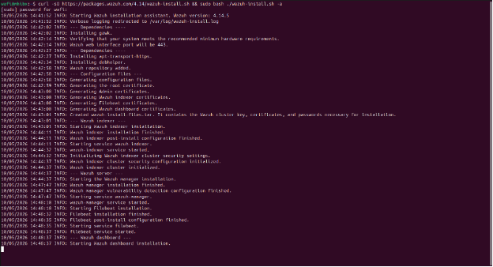
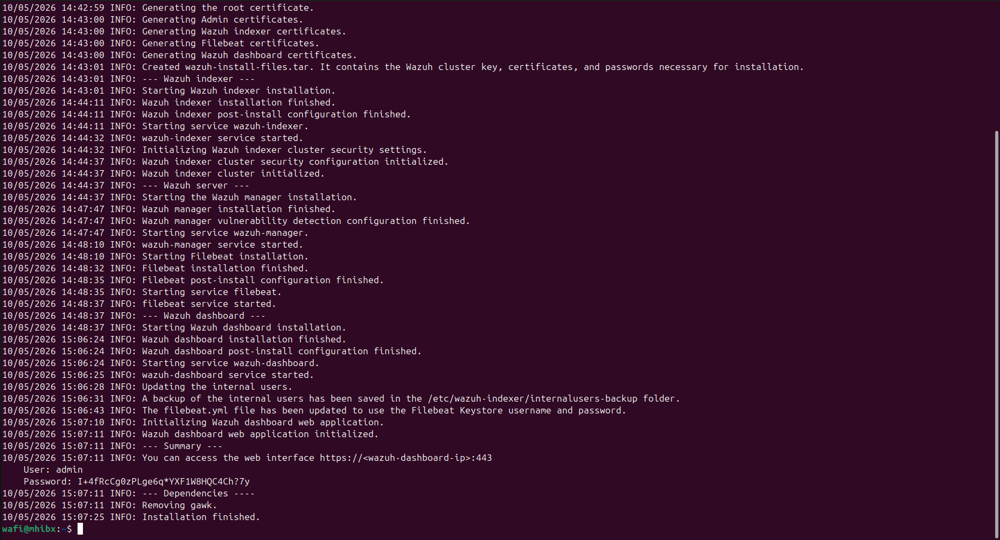
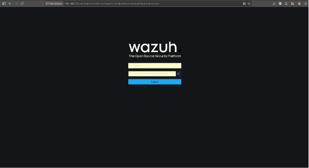

# Wazuh Installation

## Objective

Deploy an all-in-one Wazuh server using the official Wazuh installation method.

The installation provides the core SIEM components required for the lab and prepares the environment for Windows endpoint integration.

## Installation Method

The Wazuh Quickstart installation method was used to deploy the server components.

```bash
curl -sO https://packages.wazuh.com/...
```



## Components Installed

The installation includes:

- Wazuh Manager
- Wazuh Dashboard
- Wazuh Indexer



## Verification

After installation, the environment was verified by checking:

- Wazuh Dashboard accessibility
- Wazuh services status
- Indexer health

## Result

The Wazuh server was successfully deployed as an all-in-one SIEM environment and was ready for Windows endpoint integration.


