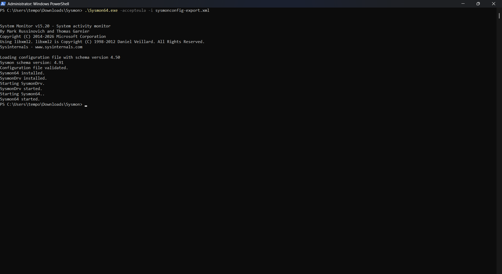
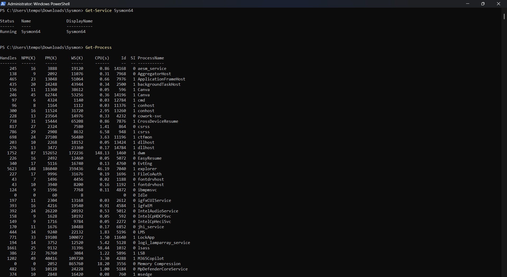
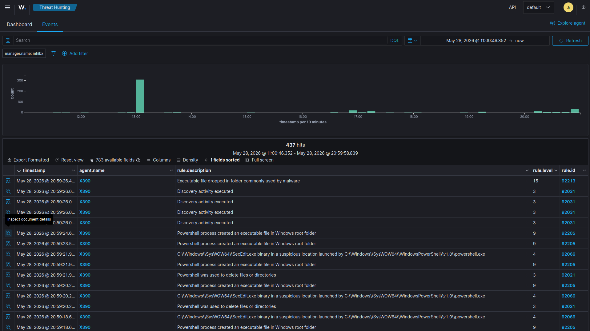
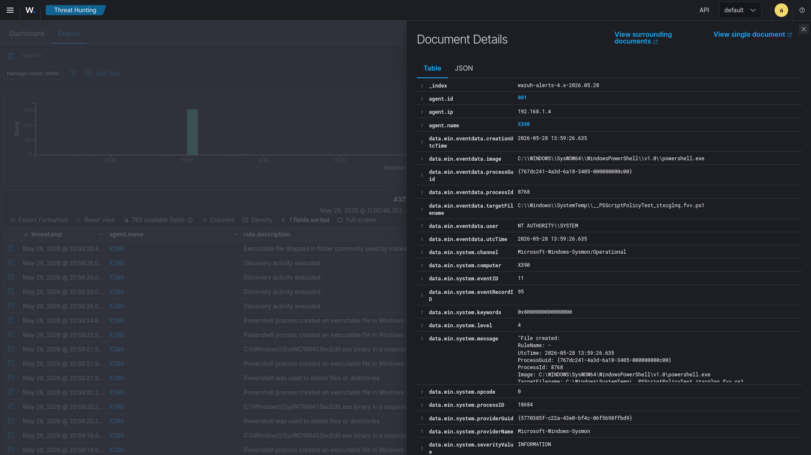

# PowerShell Activity Monitoring

## Overview

This lab demonstrates endpoint telemetry monitoring using Sysmon integrated with Wazuh.

PowerShell execution events were collected and analyzed through centralized SIEM monitoring.

---

## Objectives

- Integrate Sysmon with Wazuh
- Monitor PowerShell execution
- Analyze process creation events
- Investigate suspicious PowerShell activity

---

## Detection Scenario

Sysmon was configured to forward Operational events to the Wazuh Agent.

The following PowerShell commands were executed:

```powershell
Get-Process

whoami
```

---

## Detection Results

The following detections were observed:

- Discovery activity
- PowerShell process execution
- Process creation events
- Suspicious executable creation
- File deletion activity

---

## Detection Sources

| Source | Description |
|---------|-------------|
| Sysmon | Process Creation |
| Windows Event Logs | PowerShell Activity |
| Wazuh | Alert Correlation |

---

## Screenshots









---

## Skills Demonstrated

- Sysmon Deployment
- Endpoint Telemetry
- SIEM Monitoring
- Process Monitoring
- Threat Hunting
- PowerShell Monitoring

---

## References

- Sysmon
- SwiftOnSecurity Sysmon Configuration
- Wazuh Documentation
