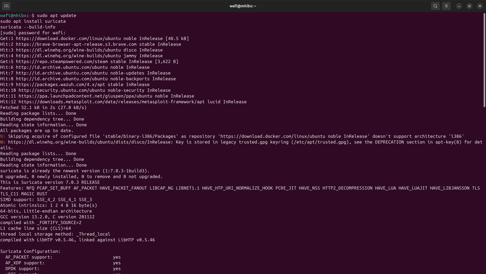
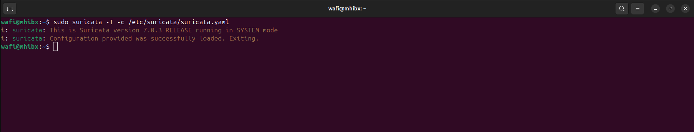
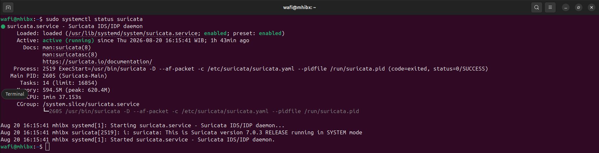
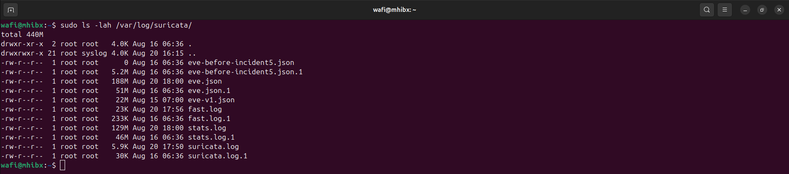

# Suricata Installation

## Objective

Install and prepare Suricata on the Ubuntu server as a network security monitoring sensor.

Suricata is used in this lab to inspect network traffic and generate security alerts based on its detection rules.

The Suricata sensor will later be integrated with Wazuh so that network security alerts can be collected and investigated alongside endpoint telemetry.

---

## Lab Environment

| Component | Value |
|-----------|-------|
| Operating System | Ubuntu 24.04.4 LTS |
| Server Role | Wazuh + Suricata |
| Wazuh Server IP | 192.168.1.7 |
| Suricata | IDS / Network Security Monitoring |
| SIEM | Wazuh |

---

## Installation

Suricata was installed on the Ubuntu server using the system package manager.

```bash
sudo apt update
sudo apt install suricata
```

After installation, verify that Suricata is available:

```bash
suricata --build-info
```

The installed version and build information should be displayed.



---

## Configuration Location

The main Suricata configuration file is located at:

```text
/etc/suricata/suricata.yaml
```

The configuration file controls important components such as:

- Network interfaces
- Home network configuration
- Rule paths
- Logging
- Output formats
- Detection settings

The default configuration was used as the starting point for the lab.

---

## Configuration Validation

Before starting the service, the Suricata configuration can be validated using:

```bash
sudo suricata -T -c /etc/suricata/suricata.yaml
```

A successful validation indicates that the configuration can be loaded without syntax errors.

Expected result:

```text
Configuration provided was successfully loaded.
```



---

## Service Verification

Check the Suricata service status:

```bash
sudo systemctl status suricata
```

If the service is not running, start it with:

```bash
sudo systemctl start suricata
```

Enable Suricata to start automatically with the system:

```bash
sudo systemctl enable suricata
```

Verify the service again:

```bash
sudo systemctl status suricata
```



---

## Log Locations

Suricata stores its logs under:

```text
/var/log/suricata/
```

Important log files include:

```text
fast.log
eve.json
stats.log
suricata.log
```

The `eve.json` file is particularly important for SIEM integration because it provides structured JSON-based security telemetry.

Example:

```bash
sudo ls -lah /var/log/suricata/
```



---

## Initial Verification

The initial deployment was considered successful when:

- Suricata was installed successfully.
- The configuration passed validation.
- The Suricata service was running.
- The Suricata log directory was available.
- Suricata was ready to inspect network traffic.

At this stage, Suricata is functioning as an independent network security monitoring component.

---

## Architecture

The planned monitoring architecture is:

```text
Network Traffic
       |
       v
   Suricata
       |
       | Network Security Telemetry
       v
   eve.json
       |
       v
   Wazuh Agent
       |
       v
  Wazuh Manager
       |
       v
    Indexer
       |
       v
   Dashboard
```

This architecture allows endpoint telemetry from Sysmon and network telemetry from Suricata to be investigated through the same SIEM platform.

---

## Troubleshooting

If Suricata fails to start, the following checks can be performed.

### Check Service Status

```bash
sudo systemctl status suricata
```

### Check Service Logs

```bash
sudo journalctl -u suricata --no-pager
```

### Validate Configuration

```bash
sudo suricata -T -c /etc/suricata/suricata.yaml
```

### Check Network Interfaces

```bash
ip addr
```

The selected interface should correspond to the network interface that Suricata is expected to monitor.

---

## Result

Suricata was successfully installed and prepared on the Ubuntu server.

The sensor is ready for the next stage of the lab:

1. Configure the monitoring interface.
2. Configure Suricata rules.
3. Generate controlled network activity.
4. Verify Suricata alerts.
5. Forward `eve.json` telemetry to Wazuh.
6. Investigate network alerts through the Wazuh Dashboard.

---

## Skills Demonstrated

- Suricata Installation
- Linux Administration
- IDS Deployment
- Configuration Validation
- Systemd Service Management
- Network Security Monitoring
- Security Telemetry
- SIEM Integration Preparation

---

## Evidence

The following evidence should be collected during the installation process:

- Suricata installation output
- Configuration validation result
- Suricata service status
- Suricata log directory
- Suricata version/build information

Screenshots:

```text
screenshots/
├── suricata-01-installation.png
├── suricata-02-test.png
├── suricata-03-status.png
└── suricata-04-logdir.png
```
