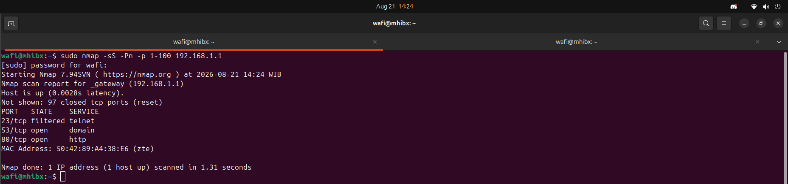
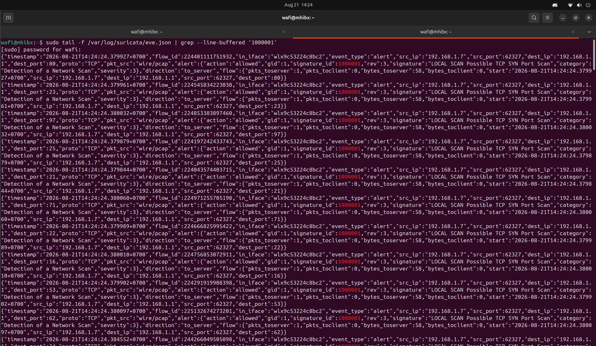

# Suricata Detection Validation

## Objective

Validate that Suricata can detect suspicious network activity and forward the resulting alerts to Wazuh.

The validation focuses on a controlled TCP SYN scan performed against a local network host.

## Test Scenario

| Item | Value |
|------|-------|
| Detection Type | TCP SYN Port Scan |
| Tool | Nmap |
| Source | 192.168.1.7 |
| Target | 192.168.1.1 |
| Suricata Rule | SID 1000001 |
| Wazuh Integration | Enabled |

## Attack Simulation

A controlled SYN scan was performed using Nmap.

    sudo nmap -sS -Pn -p 1-100 192.168.1.1

The scan was performed only against the local lab environment.

## Suricata Detection

Suricata generated an alert matching the custom detection rule:

    LOCAL SCAN Possible TCP SYN Port Scan

The corresponding Suricata signature ID was:

    1000001

The alert was recorded in:

    /var/log/suricata/eve.json

Example verification:

    sudo grep '"signature_id":1000001' /var/log/suricata/eve.json

## Wazuh Detection

The Suricata alert was collected by Wazuh through the configured `eve.json` integration.

The event was processed by the Suricata Wazuh rule:

    86601

The event could be verified in:

    /var/ossec/logs/alerts/alerts.json

Example verification:

    sudo grep -i "LOCAL SCAN Possible TCP SYN Port Scan" /var/ossec/logs/alerts/alerts.json | tail

## Detection Flow

The validated detection pipeline is:

    Nmap SYN Scan
          ↓
    Network Interface
          ↓
    Suricata
          ↓
    Custom Rule 1000001
          ↓
    /var/log/suricata/eve.json
          ↓
    Wazuh
          ↓
    Rule 86601
          ↓
    Wazuh Alert

## Result

The validation confirmed that the lab can detect controlled network scanning activity using Suricata and forward the resulting security event to Wazuh for centralized monitoring.

This demonstrates an end-to-end IDS and SIEM detection workflow within the lab environment.
