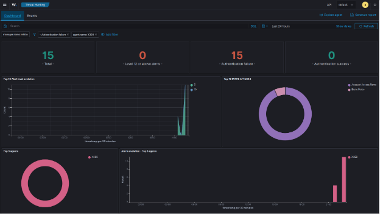
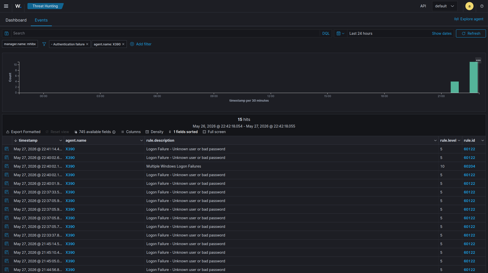

# Brute Force Investigation

## Investigation Summary

This scenario investigates repeated failed authentication attempts to simulate brute-force behavior.

Multiple invalid login attempts were generated within a short period to observe alert correlation inside Wazuh.

---

## Attack Scenario

Multiple consecutive invalid credentials were entered during Windows logon.

This generated repeated Windows Event ID 4625 entries.

---

## Evidence

| Item | Value |
|------|-------|
| Event ID | 4625 |
| Category | authentication_failed |
| Detection | Repeated Failed Login |
| Endpoint | WIN11 |

---

## Investigation Findings

Wazuh successfully detected:

- Multiple failed logins
- Alert spikes
- Authentication event grouping
- Timeline correlation
- Centralized event visibility

---

## Indicators

Observed indicators included:

- Consecutive failed logins
- High alert frequency
- Authentication spikes
- Repeated security events

---

## Security Relevance

Repeated failed authentication attempts may indicate:

- Password guessing
- Brute-force attack
- Unauthorized access attempts
- Account compromise attempts

Authentication monitoring is an important defensive control for SOC operations.

---

## Skills Demonstrated

- Authentication Monitoring
- Threat Hunting
- SIEM Investigation
- Event Correlation
- Log Analysis
