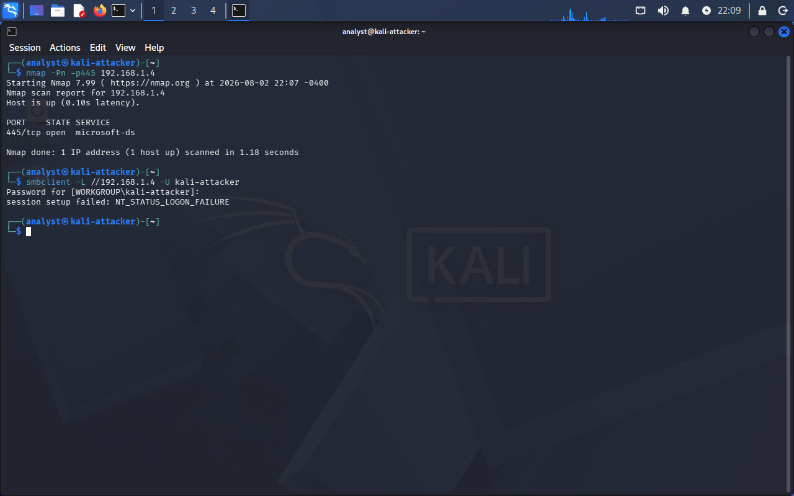
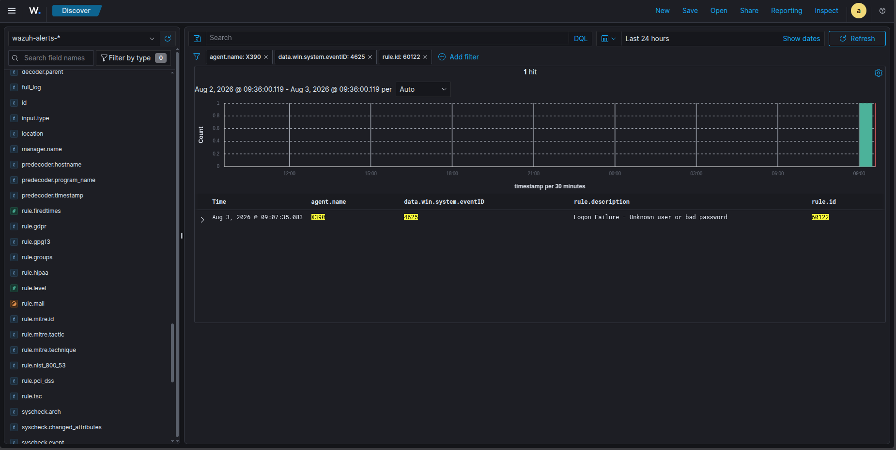
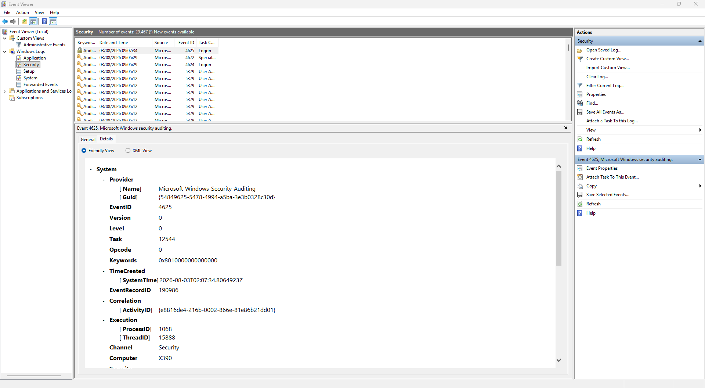
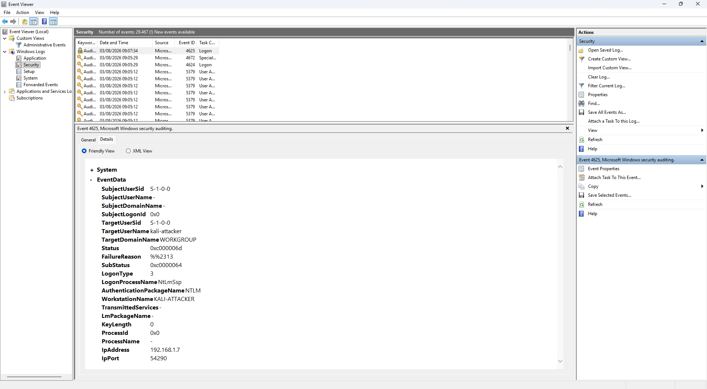
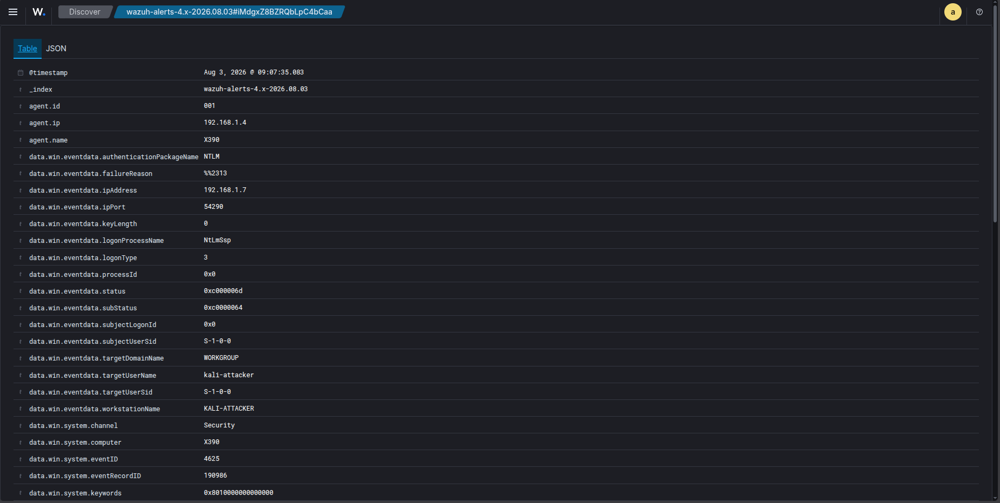
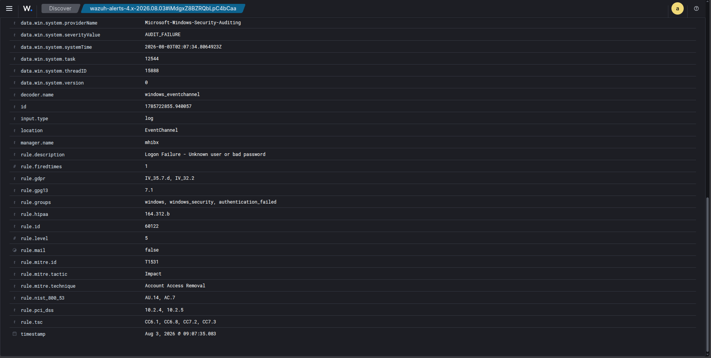
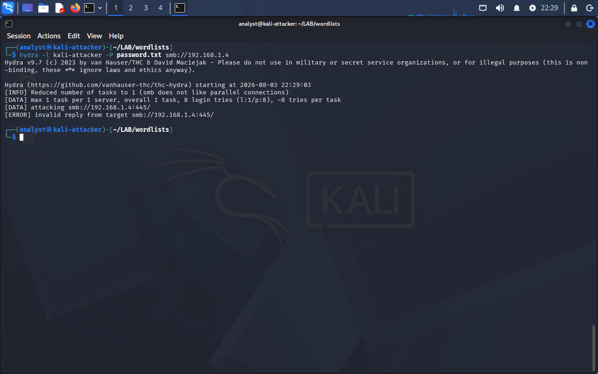
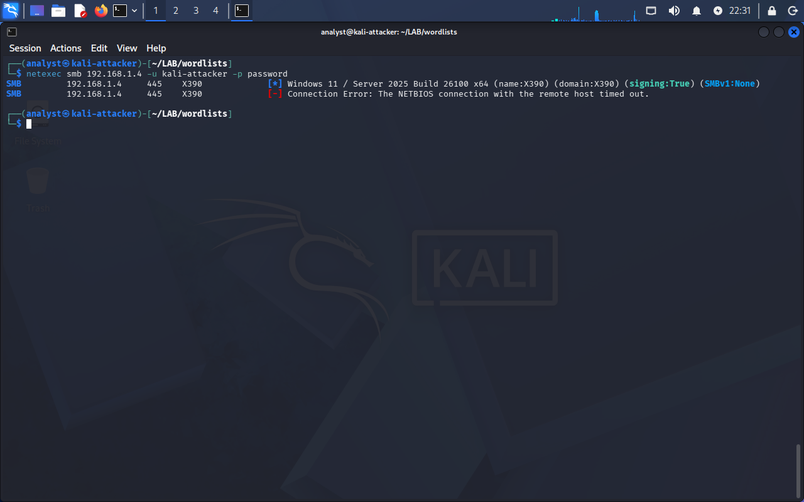
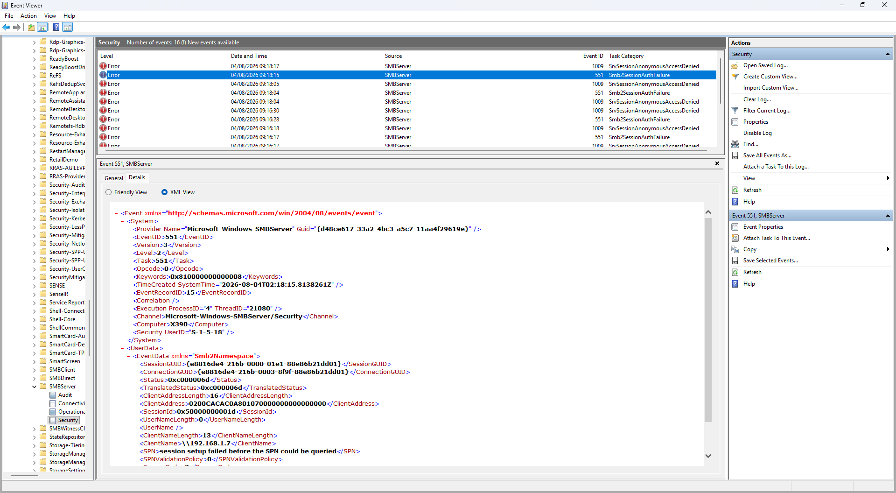

# Incident 01 — SMB Authentication Failure Detection with Wazuh

## Overview

This investigation demonstrates how Wazuh can detect and investigate a failed SMB authentication attempt against a Windows endpoint.

The scenario simulates an authentication attempt from a Kali Linux machine using an invalid account. The Windows endpoint records the failed authentication as Security Event ID 4625, which is then collected by the Wazuh Agent and surfaced as a security alert.

The main focus of this exercise was not simply generating an alert, but following the event through the monitoring pipeline and validating the available evidence during the investigation.

---

## Objectives

- Simulate a failed SMB authentication attempt from Kali Linux
- Generate Windows Security Event ID 4625
- Verify that the Wazuh Agent collects the event
- Investigate the resulting Wazuh alert
- Trace the activity from the attacker machine to the SIEM
- Evaluate different tools for generating repeated SMB authentication attempts

---

## Lab Architecture

~~~text
                    +----------------------+
                    |    Kali Linux VM     |
                    | 192.168.122.64       |
                    +----------+-----------+
                               |
                     SMB Authentication
                               |
                               ▼
                    +----------------------+
                    | Windows 10 Endpoint  |
                    | 192.168.1.4          |
                    | Wazuh Agent          |
                    +----------+-----------+
                               |
                         Security Event
                         Event ID 4625
                               |
                               ▼
                    +----------------------+
                    | Wazuh Manager        |
                    | Ubuntu               |
                    | 192.168.1.7          |
                    +----------------------+
~~~

---

## Environment

| Component | Value |
|-----------|-------|
| SIEM | Wazuh 4.x |
| Manager OS | Ubuntu |
| Endpoint | Windows 10 |
| Attacker | Kali Linux |
| Protocol | SMB |
| Windows Event | 4625 |
| Authentication | NTLM |

---

## Attack Scenario

The simulated attacker attempts to authenticate to the Windows SMB service using a non-existent account.

The Windows endpoint rejects the authentication request and records Security Event ID 4625.

The Wazuh Agent forwards the event to the Wazuh Manager, where Rule ID 60122 identifies the failed authentication.

The investigation then uses both Windows Event Viewer and Wazuh to validate the event and understand the authentication failure.

---

# Attack Simulation

## Step 1 — Verify SMB Service

The first step was to verify that the SMB service was reachable from the attacker machine.

~~~bash
nmap -Pn -p445 192.168.1.4
~~~

Result:

- TCP/445 was open.

---

## Step 2 — Attempt SMB Authentication

A failed authentication attempt was generated using `smbclient` with an invalid username.

~~~bash
smbclient -L //192.168.1.4 -U kali-attacker
~~~

Result:

~~~text
NT_STATUS_LOGON_FAILURE
~~~

The failed authentication generated Windows Security Event ID 4625.

---

# Detection

Wazuh generated Rule ID **60122** for the failed authentication.

| Item | Value |
|------|-------|
| Rule ID | 60122 |
| Description | Logon Failure - Unknown user or bad password |

The alert confirmed that the failed authentication attempt had successfully passed through the monitoring pipeline.

---

# Investigation

## Windows Event Viewer

The corresponding Windows Security event was reviewed to understand the authentication failure in more detail.

| Field | Value |
|-------|-------|
| Event ID | 4625 |
| Log | Security |
| Authentication | NTLM |
| Source IP | 192.168.1.7 |
| Workstation | KALI-ATTACKER |
| Target User | kali-attacker |
| Failure Reason | Unknown user name or bad password |
| Status | 0xC000006D |
| SubStatus | 0xC0000064 |

These fields provided additional context beyond the Wazuh alert itself, including the authentication package, workstation name, target username, and reason for the failure.

---

## Wazuh Alert Analysis

The corresponding Wazuh alert contained the following information:

| Field | Value |
|-------|-------|
| Agent | X390 |
| Event ID | 4625 |
| Rule ID | 60122 |
| Authentication | NTLM |
| Source IP | 192.168.1.7 |
| Workstation | KALI-ATTACKER |
| Username | kali-attacker |

The Wazuh alert and the Windows event provided consistent evidence that the authentication attempt had failed and allowed the activity to be investigated from the SIEM.

---

# Attack Timeline

~~~text
Kali Linux
    │
    ▼
SMB Authentication Attempt
    │
    ▼
Windows Security Event 4625
    │
    ▼
Wazuh Agent
    │
    ▼
Wazuh Manager
    │
    ▼
Rule 60122 Triggered
    │
    ▼
SOC Investigation
~~~

---

# MITRE ATT&CK

The activity simulated in this lab represents a failed authentication attempt and can be relevant to credential access scenarios such as password guessing or brute-force activity.

Potential ATT&CK mapping:

- **T1110 — Brute Force** *(future enhancement)*
- **TA0006 — Credential Access**

> Note:
>
> Wazuh's default rule maps Event ID 4625 differently. The ATT&CK mapping above is used as an educational representation of the simulated attack scenario. Custom MITRE mapping will be implemented in future detection engineering exercises.

---

# Findings

The investigation confirmed that:

- SMB was reachable from the attacker machine.
- An invalid SMB authentication attempt generated Windows Security Event ID 4625.
- The Wazuh Agent successfully collected the event.
- Wazuh Rule 60122 detected the failed authentication.
- The alert contained useful investigation context, including the source IP, workstation name, authentication package, and username.
- Windows Event Viewer provided additional details about the authentication failure that were useful for investigation.

---

# Investigation Notes

During the lab, multiple SMB clients were evaluated to determine whether they could be used to generate repeated failed authentication attempts.

## smbclient

`smbclient` successfully initiated an SMB authentication request using an invalid username.

The attempt generated:

- Windows Security Event ID 4625
- Wazuh Rule ID 60122
- Logon Type 3 (Network Logon)

This became the primary method used to validate the SIEM detection pipeline.

## Hydra

Hydra was tested as a way to automate SMB password-guessing attempts.

However, it returned:

~~~text
[ERROR] invalid reply from target smb://192.168.1.4:445/
~~~

No repeated authentication events were generated through this method.

## NetExec

NetExec was able to fingerprint the target and identified:

- Windows 11 Build 26100
- SMB Signing Enabled
- SMBv1 Disabled

However, the authentication process failed with:

~~~text
Connection Error:
The NETBIOS connection with the remote host timed out
~~~

The Windows SMB Server logs recorded additional events:

- Event ID 551 — Smb2SessionAuthFailure
- Event ID 1009 — SrvSessionAnonymousAccessDenied

The authentication session terminated before username validation, preventing repeated Event ID 4625 entries from being generated.

Further investigation is required to determine whether this behavior is related to compatibility between NetExec/Hydra and the Windows 11 Build 26100 SMB implementation.

---

# Lessons Learned

This investigation provided practical experience with the relationship between endpoint telemetry and SIEM detection.

Key takeaways include:

- A successful TCP connection to SMB does not guarantee a successful authentication session.
- Windows can record authentication failures across multiple logging channels.
- Security Event ID 4625 provides useful information for investigating failed authentication attempts.
- Windows Security logs and Microsoft-Windows-SMBServer logs can provide complementary evidence.
- Different authentication tools may interact with modern Windows SMB implementations differently.
- Troubleshooting an unsuccessful attack simulation is also part of security engineering.
- A SOC investigation should validate assumptions using multiple sources rather than relying on a single tool or alert.

---

# Future Improvements

- Investigate SMB authentication behavior on Windows 11 Build 26100.
- Test additional SMB authentication tools.
- Create custom Wazuh detection rules for repeated failed logon attempts.
- Simulate password spraying and brute-force activity after resolving tool compatibility issues.
- Correlate Windows Security Event 4625 and SMB Server events into a higher-confidence detection.
- Visualize authentication trends using Wazuh dashboards.

---

# Repository Status

**Current Status: Baseline Detection Completed**

- SMB connectivity verified
- Failed SMB authentication successfully simulated
- Windows Security Event ID 4625 collected
- Wazuh Rule 60122 validated
- Investigation evidence documented
- Multiple SMB authentication tools evaluated

Advanced attack simulation, including password spraying and brute-force scenarios, remains planned for a future iteration after the SMB client compatibility issues are investigated.
