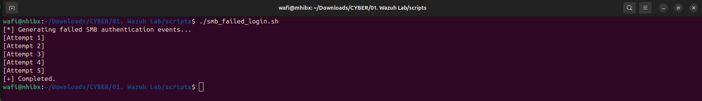
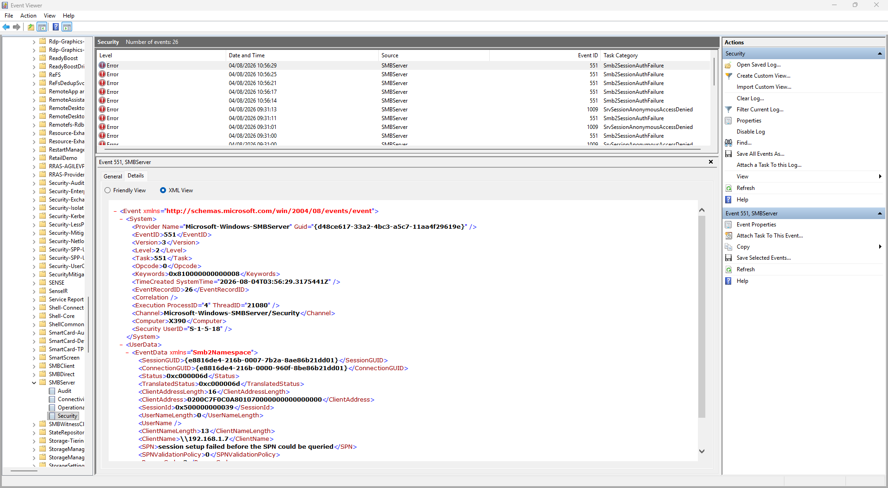
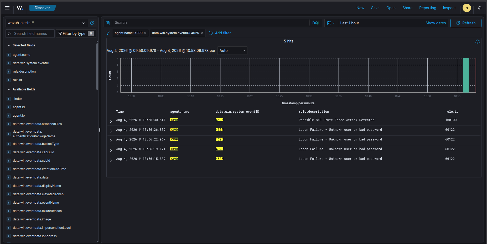

# Incident 02 - SMB Brute Force Detection using Custom Wazuh Rule

## Overview

This lab demonstrates how to create a custom Wazuh correlation rule to detect potential SMB brute-force attacks against a Windows endpoint.

Instead of relying only on Wazuh's default authentication failure rule, this investigation creates a higher-level detection that correlates multiple failed login attempts within a short period of time.

---

# Objectives

- Simulate multiple failed SMB authentication attempts
- Generate Windows Security Event ID 4625
- Observe Wazuh default detection (Rule 60122)
- Develop a custom Wazuh correlation rule
- Trigger a new alert after repeated authentication failures
- Document the complete detection workflow

---

# Lab Environment

| Component | Value |
|-----------|------|
| SIEM | Wazuh 4.x |
| Attacker | Kali Linux |
| Target | Windows 11 |
| Attack Protocol | SMB |
| Windows Event | 4625 |
| Default Wazuh Rule | 60122 |
| Custom Rule | 100100 |

---

# Network Topology

| Host | IP Address |
|------|-----------|
| Kali Attacker | 192.168.1.7 |
| Windows 11 | 192.168.1.4 |
| Wazuh Server | 192.168.1.7 |

---

# Attack Simulation

A Bash script was created to simulate repeated failed SMB authentication attempts.

```bash
./scripts/smb_failed_login.sh
```

The script performs five consecutive failed login attempts against the SMB service.

---

# Detection Flow

```text
Kali Linux
        │
        ▼
Repeated SMB Login Attempts
        │
        ▼
Windows Security Event
Event ID 4625
        │
        ▼
Wazuh Rule 60122
(Logon Failure)
        │
        ▼
Custom Rule 100100
(Possible SMB Brute Force Attack)
```

---

# Custom Rule

```xml
<rule id="100100"
      level="10"
      frequency="5"
      timeframe="60">

    <if_matched_sid>60122</if_matched_sid>

    <description>
        Possible SMB Brute Force Attack Detected
    </description>

    <group>windows,authentication,bruteforce,</group>

    <mitre>
        <id>T1110</id>
    </mitre>

</rule>
```

---

# Evidence

## Script Execution



---

## Windows Event Viewer

Security Event

Event ID:

```
4625
```

Authentication Package

```
NTLM
```

Logon Type

```
3
```

Source IP

```
192.168.1.7
```



---

## Default Detection

Rule ID

```
60122
```

Description

```
Logon Failure - Unknown user or bad password
```

---

## Custom Detection

Rule ID

```
100100
```

Description

```
Possible SMB Brute Force Attack Detected
```

Level

```
10
```

MITRE ATT&CK

```
T1110 - Brute Force
```

---

# Detection Timeline

| Time | Event |
|------|-------|
|10:56:15|4625|
|10:56:19|4625|
|10:56:22|4625|
|10:56:26|4625|
|10:56:30|Custom Rule 100100 Triggered|



---

# Lessons Learned

During this lab, I learned how Wazuh correlates multiple authentication failure events into a higher-level security alert.

One important lesson was that `frequency` and `timeframe` are rule attributes rather than XML elements. Running `wazuh-analysisd -t` before restarting the manager proved essential for validating custom rules and preventing configuration errors.

This lab also demonstrated how custom detection engineering can extend Wazuh beyond its default rules by creating organization-specific alerts.

---

# Future Improvements

- Correlate authentication failures by source IP
- Correlate repeated failures for the same username
- Reduce false positives
- Add Active Response to block attacking IP addresses
- Create custom dashboard visualizations
- Detect password spraying separately from brute-force attacks

---

# Skills Demonstrated

- Windows Event Analysis
- SMB Authentication
- Event ID 4625 Investigation
- Wazuh Rule Development
- Detection Engineering
- Rule Correlation
- MITRE ATT&CK Mapping
- SIEM Validation
- Security Monitoring
