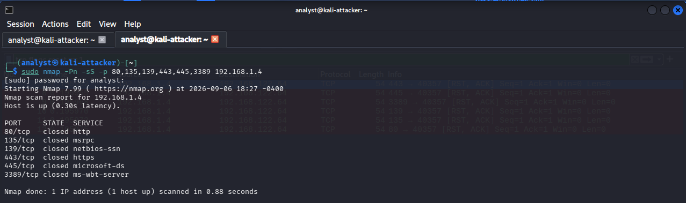
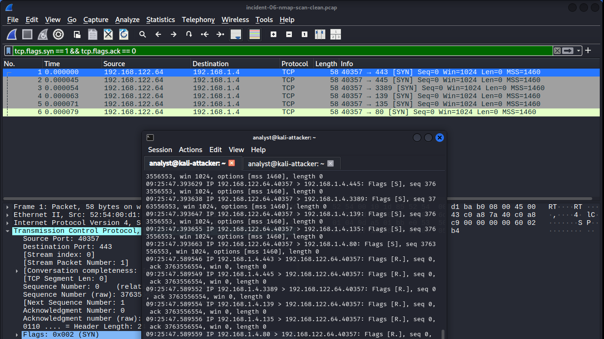
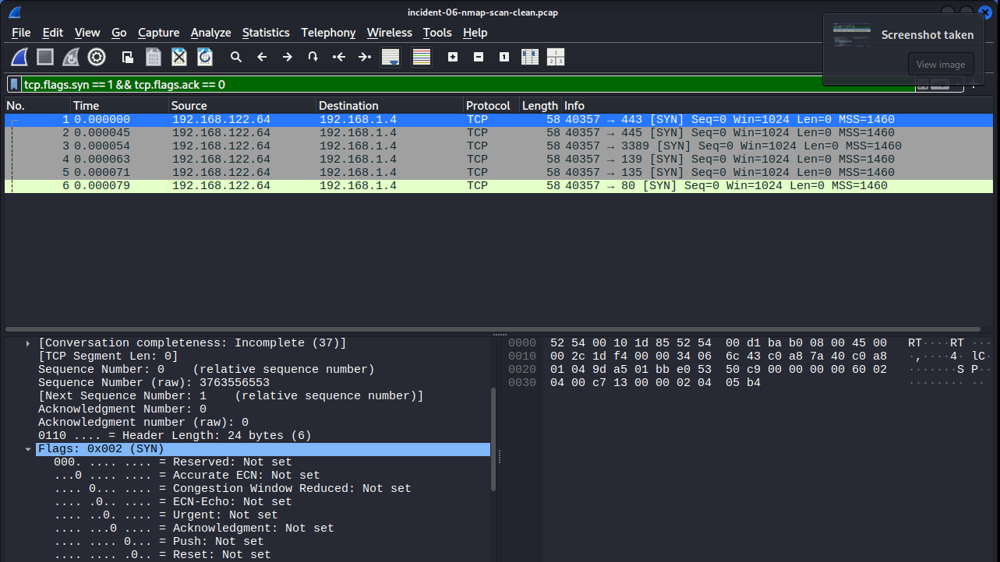
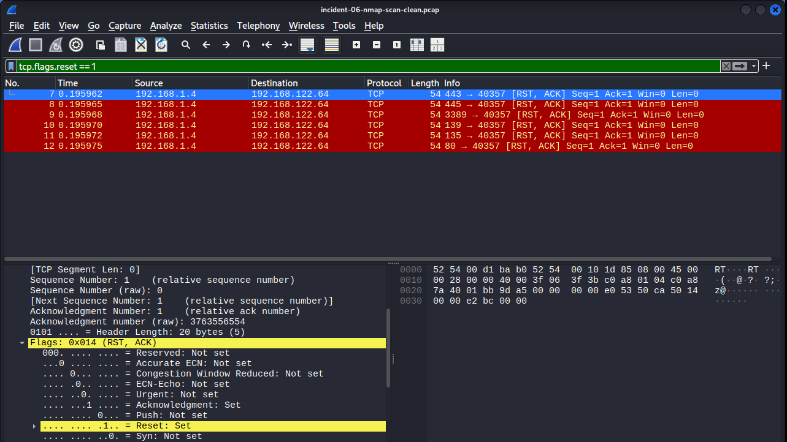
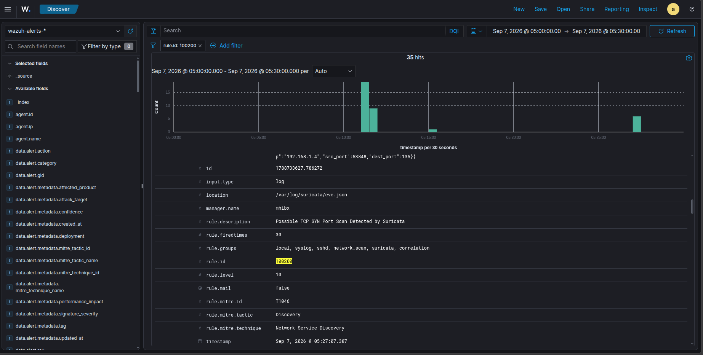

# Incident 06 — Network Reconnaissance Investigation

## Overview

This investigation examines a controlled network reconnaissance activity against the Windows endpoint in the lab.

A targeted TCP SYN scan was generated from the Kali attacker VM against selected TCP ports on the Windows endpoint. The traffic was captured for packet-level analysis, detected by Suricata, and then ingested into Wazuh where it was promoted to a higher-level SIEM alert.

The investigation demonstrates an end-to-end network monitoring workflow:

```text
Nmap
  ↓
Network Traffic
  ↓
PCAP / Wireshark
  ↓
Suricata Detection
  ↓
Wazuh
  ↓
SOC Investigation
```

The activity was intentionally performed in the isolated lab environment. No exploitation or service compromise was attempted.

---

## Objectives

- Generate controlled TCP SYN reconnaissance traffic.
- Capture the traffic as PCAP evidence.
- Analyze the TCP exchange using Wireshark.
- Identify the reconnaissance pattern at packet level.
- Validate Suricata detection of the scan.
- Validate Suricata alert ingestion into Wazuh.
- Correlate evidence across the packet capture, IDS, and SIEM.
- Map the observed behavior to MITRE ATT&CK.

---

## Lab Environment

| Component | Details |
|---|---|
| Attacker / Test VM | Kali Linux |
| Kali IP | `192.168.122.64` |
| Wazuh / Suricata Server | Ubuntu 24.04 |
| Ubuntu IP | `192.168.1.7` |
| Windows Endpoint | X390 / Windows 11 |
| Windows IP | `192.168.1.4` |
| Network IDS | Suricata |
| SIEM | Wazuh |
| Packet Analysis | Wireshark |
| Scan Tool | Nmap |

### Network Topology

```text
┌─────────────────────┐
│ Kali Linux          │
│ 192.168.122.64      │
└─────────┬───────────┘
          │
          │ routed / NATed traffic
          ▼
┌─────────────────────┐
│ Ubuntu Wazuh Server │
│ 192.168.1.7         │
│                     │
│ Wazuh + Suricata    │
└─────────┬───────────┘
          │
          ▼
┌─────────────────────┐
│ Windows X390        │
│ 192.168.1.4         │
└─────────────────────┘
```

Because the Kali VM is routed through the Ubuntu host, the Windows endpoint and Suricata may observe `192.168.1.7` as the source address. The Kali-side packet capture retains the original Kali address `192.168.122.64`. The ephemeral source port `53848` was used as an additional correlation point.

---

# 1. Activity Simulation

The reconnaissance activity was generated with Nmap:

```bash
sudo nmap -Pn -sS -p 80,135,139,443,445,3389 192.168.1.4
```

The scan confirmed that the Windows host was reachable and returned the following results:

```text
PORT      STATE
80/tcp    closed
135/tcp   closed
139/tcp   closed
443/tcp   closed
445/tcp   closed
3389/tcp  closed
```

The purpose of this scan was not to identify a vulnerable service, but to generate observable reconnaissance traffic for the monitoring stack.

### Evidence



---

# 2. Packet Capture and Wireshark Analysis

The scan traffic was captured as a PCAP and analyzed in Wireshark.

The captured traffic showed multiple TCP SYN packets from the Kali VM toward different destination ports on `192.168.1.4`.

Example:

```text
192.168.122.64:40357 → 192.168.1.4:445  SYN
192.168.122.64:40357 → 192.168.1.4:3389 SYN
192.168.122.64:40357 → 192.168.1.4:139  SYN
192.168.122.64:40357 → 192.168.1.4:135  SYN
192.168.122.64:40357 → 192.168.1.4:80   SYN
```

The Windows endpoint responded with TCP RST/ACK packets because the scanned ports were closed.

This is consistent with TCP SYN scan behavior:

```text
SYN
 ↓
RST/ACK
```

A successful TCP connection was not established.

### Evidence



---

## TCP Sequence Number Analysis

One packet pair was examined in more detail.

The SYN packet contained:

```text
Sequence Number (raw): 3763556553
Next Sequence Number:  3763556554
```

The corresponding RST/ACK response contained:

```text
Acknowledgment Number (raw): 3763556554
```

The acknowledgment is one greater than the SYN sequence number because a TCP SYN consumes one sequence number even though the segment carries no application data.

This provided an additional packet-level validation that the response corresponded to the observed SYN probe.

### Evidence





---

# 3. Suricata Detection

The same reconnaissance activity was observed by Suricata on interface:

```text
wlx9c53224c8bc2
```

At approximately:

```text
2026-09-07 05:27:06 WIB
```

Suricata generated alerts using the local signature:

```text
SID:
1000001

Signature:
LOCAL SCAN Possible TCP SYN Port Scan

Category:
Detection of a Network Scan

Severity:
3
```

The detected traffic included:

```text
Source:
192.168.1.7:53848

Destination:
192.168.1.4

Protocol:
TCP
```

Destination ports observed during the scan included:

```text
80
135
139
443
445
3389
```

The Suricata event recorded:

```text
action: allowed
```

This means the traffic was detected but not blocked by the IDS configuration.

The Suricata timestamp and source port matched the synchronized packet capture used for the investigation.

### Correlation Point

The Kali-side capture showed:

```text
192.168.122.64:53848 → 192.168.1.4
```

while Suricata observed:

```text
192.168.1.7:53848 → 192.168.1.4
```

The source IP difference is explained by the lab routing/NAT path through the Ubuntu host. The matching source port `53848`, destination, timing, and scan behavior provide a useful cross-layer correlation point.

### Evidence

The raw Suricata event used for this investigation is preserved in:

```text
suricata-wazuh-evidence.txt
```

---

# 4. Suricata → Wazuh Integration

The Suricata `eve.json` output was already configured as a Wazuh JSON log source:

```text
/var/log/suricata/eve.json
```

Wazuh processed the Suricata event and generated:

```text
Rule ID:
100200

Level:
10

Description:
Possible TCP SYN Port Scan Detected by Suricata
```

The Wazuh event retained the Suricata detection details, including:

```text
signature_id:
1000001

signature:
LOCAL SCAN Possible TCP SYN Port Scan

src_port:
53848

dest_ip:
192.168.1.4
```

The alert was visible in the Wazuh `wazuh-alerts-*` index after the Filebeat pipeline was restored.

### Evidence



---

# 5. Investigation Timeline

| Time (WIB) | Source | Observation |
|---|---|---|
| 05:27:06 | Nmap / PCAP | TCP SYN probes generated against selected ports |
| 05:27:06 | Wireshark | SYN packets observed toward `192.168.1.4` |
| 05:27:06 | Windows | RST/ACK responses returned for closed ports |
| 05:27:06 | Suricata | SID `1000001` detected TCP SYN scan activity |
| 05:27:07 | Wazuh | Rule `100200` generated a Level 10 alert |
| 05:27:07 | Wazuh Discover | Alert available in `wazuh-alerts-*` |

The one-second difference between the Suricata event and Wazuh alert reflects the processing path from the IDS log through the Wazuh pipeline.

---

# 6. Investigation Findings

### Finding 1 — Reconnaissance Activity Was Confirmed

Multiple SYN probes targeted different TCP ports on the same Windows endpoint.

The packet pattern was consistent with network service discovery rather than a normal single connection attempt.

### Finding 2 — The Target Was Reachable

Nmap reported the Windows host as up.

All six selected ports returned `closed`, meaning no successful TCP connection was established during this scan.

### Finding 3 — Suricata Detected the Activity

Suricata identified the traffic using SID `1000001`:

```text
LOCAL SCAN Possible TCP SYN Port Scan
```

### Finding 4 — Wazuh Promoted the IDS Event

Wazuh generated Rule `100200`:

```text
Possible TCP SYN Port Scan Detected by Suricata
```

with Level 10 and MITRE ATT&CK mapping T1046.

### Finding 5 — Cross-Layer Correlation Was Possible

The same activity could be correlated using:

- destination IP `192.168.1.4`
- source port `53848`
- matching timestamps
- TCP SYN scan behavior
- Suricata interface `wlx9c53224c8bc2`
- Wazuh Rule `100200`
- Suricata SID `1000001`

---

# 7. MITRE ATT&CK

The Wazuh detection maps the activity to:

| Field | Value |
|---|---|
| Technique | T1046 |
| Technique Name | Network Service Discovery |
| Tactic | Discovery |

The mapping describes the observed reconnaissance behavior. The activity in this investigation was intentionally generated in the lab and did not involve exploitation or compromise.

---

# 8. Detection and Investigation Perspective

This investigation demonstrates the difference between three layers of security monitoring:

```text
Network Activity
      ↓
Telemetry
      ↓
Detection
      ↓
SIEM Alert
      ↓
Analyst Investigation
```

Nmap generated the activity, while the PCAP provided raw packet evidence.

Wireshark allowed the traffic to be examined at packet level, including TCP flags and sequence numbers.

Suricata provided network-based detection.

Wazuh then ingested the IDS event and promoted it into an analyst-facing alert.

This separation is important because a SOC analyst should not rely on a single detection source when investigating network activity.

---

# 9. Limitations and Context

## NAT / Source Address Visibility

The Kali VM uses:

```text
192.168.122.64
```

but Suricata and the Windows-side network path can observe:

```text
192.168.1.7
```

because the traffic is routed through the Ubuntu host.

This means an analyst looking only at the Suricata/Wazuh alert could incorrectly assume that `192.168.1.7` originated the scan.

The packet capture and lab topology provide the additional context needed to understand the source.

## Detection Does Not Mean Prevention

The Suricata event recorded:

```text
action: allowed
```

The IDS detected the activity but did not block it.

This is expected for the current lab configuration.

## No Exploitation Was Performed

The scan only generated TCP reconnaissance traffic. No attempt was made to exploit the detected services or gain access to the Windows endpoint.

---

# 10. Evidence

The investigation evidence consists of:

```text
screenshots/
└── incident-06/
    ├── nmap-scan.png
    ├── wireshark-syn-scan.png
    ├── wireshark-syn-sequence.png
    ├── wireshark-rst-ack.png
    └── wazuh-suricata-alert.png

suricata-wazuh-evidence.txt
```

The original synchronized PCAP should be retained separately as:

```text
incident-06-nmap-correlated.pcap
```

The PCAP is the primary raw network evidence, while the screenshots provide concise visual evidence for the investigation write-up.

---

# Conclusion

This investigation demonstrated an end-to-end network reconnaissance detection workflow using Nmap, Wireshark, Suricata, and Wazuh.

The activity began as a controlled TCP SYN scan against the Windows endpoint. Packet capture confirmed the individual SYN probes and corresponding RST/ACK responses. Suricata identified the behavior using a local TCP SYN port scan signature, and Wazuh ingested the resulting IDS event and generated a Level 10 alert through Rule 100200.

The most valuable part of the investigation was the correlation between the different telemetry layers. The PCAP showed the original Kali source address, while Suricata and Wazuh observed the routed source address. The matching source port, destination, timestamps, and traffic pattern allowed the events to be connected into a single investigation.

The exercise therefore moved beyond simply running a scan or viewing an IDS alert. It demonstrated how a SOC analyst can move from raw network traffic to detection and finally to contextual investigation.

---

# SOC Takeaway

A network detection is more useful when the analyst can explain **why it fired, what actually happened on the wire, where the traffic originated, and how the event moved through the monitoring stack**.

In this case:

```text
Nmap
  ↓
TCP SYN probes
  ↓
PCAP / Wireshark
  ↓
Suricata SID 1000001
  ↓
Wazuh Rule 100200
  ↓
Analyst correlation
```

That workflow provides a practical foundation for investigating network reconnaissance in a SOC environment.
