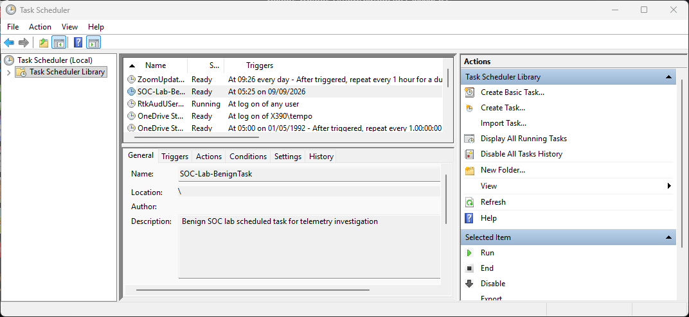
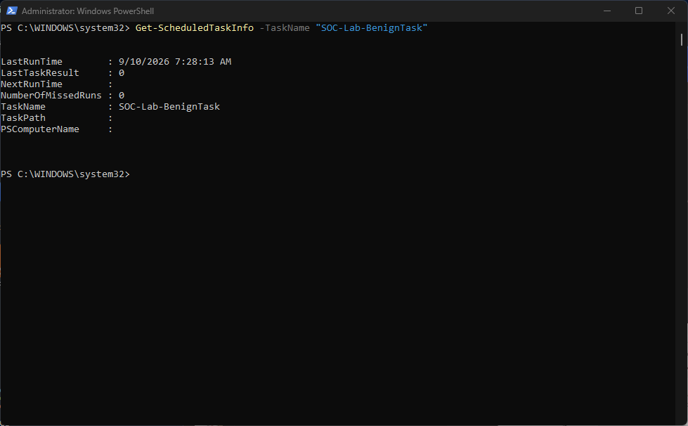
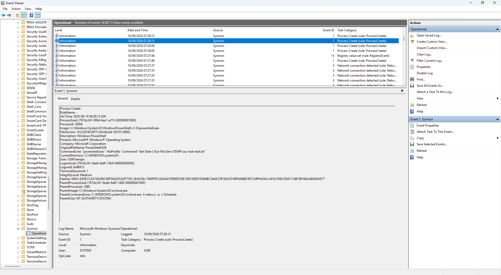
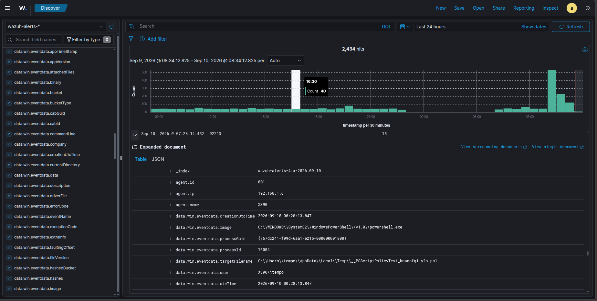
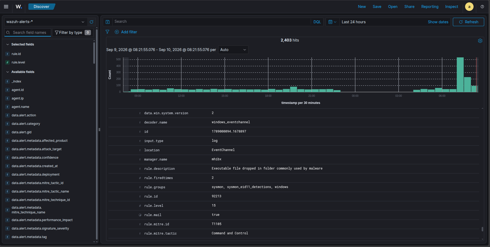

# Incident 07 — Scheduled Task Execution Investigation

## Overview

This investigation examines the execution of a benign Windows Scheduled Task and the telemetry generated during that execution.

The objective was to understand how scheduled task execution appears across Windows Task Scheduler, Sysmon, and Wazuh, and to determine what activity generated a security alert.

The scheduled task executed a controlled PowerShell command that writes the current date to a temporary file. The activity was intentionally generated for this lab and did not involve a malicious payload or external download.

The investigation focuses on the relationship between scheduled task execution, process creation telemetry, and SIEM detection.

---

## Objectives

- Create and execute a benign Windows Scheduled Task.
- Verify successful task execution.
- Identify the process created by the scheduled task.
- Investigate Sysmon process creation telemetry.
- Identify the relationship between Task Scheduler and PowerShell.
- Determine which telemetry generated a Wazuh alert.
- Distinguish raw telemetry from security alerts.
- Assess whether a dedicated custom Scheduled Task detection rule is necessary.

---

## Lab Environment

| Component | Details |
|---|---|
| Endpoint | Windows 11 — X390 |
| Endpoint IP | `192.168.1.6` |
| Wazuh Manager | Ubuntu 24.04 — mhibx |
| SIEM | Wazuh |
| Endpoint Telemetry | Sysmon |
| Scheduled Task | `SOC-Lab-BenignTask` |
| User | `X390\tempo` |
| Process | `powershell.exe` |

---

## Activity Simulation

A benign Scheduled Task was created using PowerShell:

```powershell
$action = New-ScheduledTaskAction `
    -Execute "powershell.exe" `
    -Argument '-NoProfile -Command "Get-Date | Out-File $env:TEMP\soc-task-test.txt"'

$trigger = New-ScheduledTaskTrigger -Once -At (Get-Date).AddMinutes(1)

Register-ScheduledTask `
    -TaskName "SOC-Lab-BenignTask" `
    -Action $action `
    -Trigger $trigger `
    -Description "Benign SOC lab scheduled task for telemetry investigation"
```

The task was subsequently executed during the investigation using:

```powershell
Start-ScheduledTask -TaskName "SOC-Lab-BenignTask"
```



---

## Task Execution Verification

Task execution was verified with:

```powershell
Get-ScheduledTaskInfo -TaskName "SOC-Lab-BenignTask"
```

The recorded result showed:

```text
LastRunTime    : 9/10/2026 7:28:13 AM
LastTaskResult : 0
```

`LastTaskResult : 0` confirmed that the scheduled task completed successfully.



---

## Sysmon Process Creation

The scheduled task resulted in the creation of a PowerShell process.

Sysmon Event ID 1 recorded the following process information:

```text
Event ID:
1

ProcessGuid:
{767dc241-f99d-6aa1-e215-000000001800}

ProcessId:
16004

Image:
C:\Windows\System32\WindowsPowerShell\v1.0\powershell.exe

CommandLine:
"powershell.exe" -NoProfile -Command "Get-Date | Out-File $env:TEMP\soc-task-test.txt"

User:
X390\tempo

ParentImage:
C:\Windows\System32\svchost.exe

ParentCommandLine:
C:\WINDOWS\system32\svchost.exe -k netsvcs -p -s Schedule

ParentUser:
NT AUTHORITY\SYSTEM
```

The parent command line is particularly useful because it identifies the Windows `Schedule` service hosted by `svchost.exe` as the parent context for the PowerShell process.

The observed process lineage was:

```text
svchost.exe
  └── Schedule service
        └── powershell.exe
              └── Get-Date | Out-File ...
```



---

## Wazuh Telemetry and Detection

The Sysmon events generated by the execution were ingested by Wazuh.

The PowerShell process can be correlated using the same ProcessGuid:

```text
{767dc241-f99d-6aa1-e215-000000001800}
```

The Sysmon Event ID 1 process creation event was present as Wazuh telemetry, but it did not generate a dedicated Wazuh alert identifying the activity as Scheduled Task execution.

During the same PowerShell execution, Sysmon also recorded creation of a temporary PowerShell policy-test file:

```text
C:\Users\tempo\AppData\Local\Temp\__PSScriptPolicyTest_knannfgi.y2o.ps1
```

This generated Sysmon Event ID 11 and triggered Wazuh Rule `92213`.

---

## Wazuh Rule 92213

The alert generated during the execution contained:

```text
Rule ID:
92213

Level:
15

Description:
Executable file dropped in folder commonly used by malware

Event ID:
11

ProcessId:
16004

ProcessGuid:
{767dc241-f99d-6aa1-e215-000000001800}
```

The alert therefore relates to the temporary file creation rather than directly identifying the Scheduled Task itself.



The Wazuh rule metadata shows a MITRE ATT&CK mapping of `T1105` / Ingress Tool Transfer. This is the mapping associated with the existing Wazuh rule; it is not an analyst conclusion that the benign lab activity performed an ingress tool transfer.



---

## Detection Analysis

The investigation demonstrates that one controlled activity can produce multiple layers of telemetry.

### Layer 1 — Scheduled Task

Task Scheduler confirmed that `SOC-Lab-BenignTask` existed and executed successfully.

### Layer 2 — Process Creation

Sysmon Event ID 1 recorded the resulting PowerShell process and its parent process context.

The parent command line contained:

```text
svchost.exe -k netsvcs -p -s Schedule
```

This provided evidence that the PowerShell process was launched through the Windows Task Scheduler service.

### Layer 3 — File Creation

PowerShell created a temporary policy-test file, producing Sysmon Event ID 11.

### Layer 4 — Wazuh Detection

The Event ID 11 telemetry triggered Wazuh Rule `92213`.

The resulting detection chain was:

```text
Scheduled Task
      ↓
PowerShell execution
      ↓
Sysmon Event ID 1
      ↓
Wazuh telemetry

PowerShell execution
      ↓
Temporary policy-test file
      ↓
Sysmon Event ID 11
      ↓
Wazuh Rule 92213
```

---

## Alert Assessment

Rule `92213` is a high-level Wazuh detection, but the alert itself does not establish that the activity was malicious.

The observed activity was intentionally generated as a benign lab simulation.

The PowerShell command was:

```powershell
Get-Date | Out-File $env:TEMP\soc-task-test.txt
```

No malicious payload or external download was used as part of the simulation.

The temporary PowerShell policy-test file was created during the PowerShell execution context. The alert was therefore assessed using the complete activity timeline and process context rather than being treated as proof of compromise.

**Assessment: Benign activity / expected lab behavior.**

---

## Detection Coverage and Gap

The investigation did not identify a dedicated Wazuh alert specifically stating that `SOC-Lab-BenignTask` had executed.

This does not necessarily represent a detection failure. A scheduled task can legitimately launch many different processes, and a generic rule for every process launched by the Task Scheduler service could produce significant noise.

For stronger detection, scheduled-task context could instead be combined with additional suspicious characteristics, such as:

- encoded PowerShell commands
- execution policy bypass
- suspicious script locations
- unusual child processes
- network connections
- executable creation
- known persistence indicators

This would produce higher-confidence detections than alerting on scheduled-task execution alone.

---

## MITRE ATT&CK Considerations

The investigation demonstrates process execution through the Windows Task Scheduler service.

However, the evidence collected in this simulation primarily demonstrates **scheduled task execution**, not malicious persistence. The task was intentionally created as a benign, one-time lab activity.

The existing Wazuh Rule `92213` contains the following MITRE ATT&CK mapping:

```text
T1105 — Ingress Tool Transfer
```

This mapping belongs to the Wazuh detection rule and should not be interpreted as an analyst conclusion that the simulated activity performed an ingress tool transfer.

---

## Investigation Timeline

| Time | Event |
|---|---|
| 07:28:13 | Scheduled Task execution recorded |
| 07:28:13 | Sysmon Event ID 1 records PowerShell process creation |
| 07:28:13 | PowerShell creates temporary policy-test file |
| 07:28:14 | Wazuh receives Sysmon Event ID 11 |
| 07:28:14 | Wazuh Rule 92213 generates alert |
| 07:28:13 | Scheduled task reports successful completion |

> The timestamps are based on the Windows and Wazuh evidence. The one-second difference reflects the telemetry and alert processing timeline.

---

## Findings

| Evidence | Result |
|---|---|
| Scheduled Task exists | Confirmed |
| Scheduled Task executed | Confirmed |
| Task execution result | `0` |
| PowerShell process created | Confirmed |
| Task Scheduler parent context | Confirmed |
| Sysmon Event ID 1 | Confirmed |
| Wazuh telemetry | Confirmed |
| Dedicated Scheduled Task alert | Not observed |
| Sysmon Event ID 11 | Confirmed |
| Wazuh Rule 92213 | Triggered |
| Malicious payload | Not present |
| External download | Not observed |
| Analyst assessment | Benign activity |

---

## Lessons Learned

1. **Telemetry is not the same as an alert.**

   Sysmon generated Event ID 1 telemetry that was ingested by Wazuh, but the event did not automatically become a dedicated Scheduled Task alert.

2. **An alert is not automatically malicious.**

   Rule `92213` generated a high-level alert because of the observed file creation behavior, but the activity was intentionally benign.

3. **Process lineage provides important context.**

   The relationship between `svchost.exe`, the Task Scheduler service, and `powershell.exe` helped explain why the PowerShell process existed.

4. **ProcessGuid can support correlation.**

   The same ProcessGuid connected the PowerShell process creation event with the related Event ID 11 activity.

5. **Detection rules require context and tuning.**

   A generic rule for all PowerShell processes launched through Task Scheduler could generate unnecessary noise. Stronger detections should combine execution context with additional suspicious indicators.

---

## Conclusion

The Scheduled Task investigation successfully demonstrated how benign scheduled execution appears across Windows, Sysmon, and Wazuh.

The activity was reconstructed from multiple telemetry sources:

```text
Task Scheduler
      ↓
Sysmon Event ID 1
      ↓
Wazuh telemetry
      ↓
Sysmon Event ID 11
      ↓
Wazuh Rule 92213
```

Wazuh successfully generated an alert for the temporary file creation, while no dedicated alert for the Scheduled Task execution itself was observed.

The investigation therefore focused on understanding the difference between **telemetry, detection, and analyst assessment**, rather than creating a custom rule simply to generate another alert.

---

## Status

**Investigation Completed**
