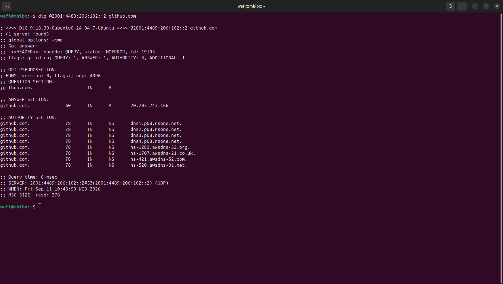
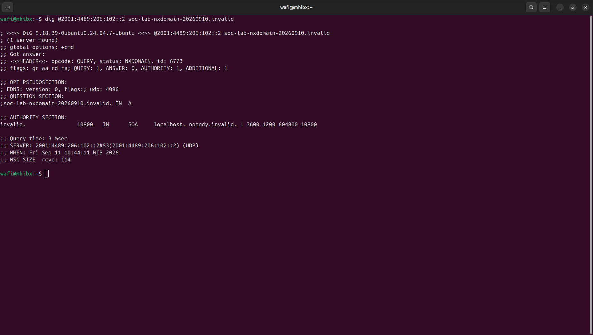
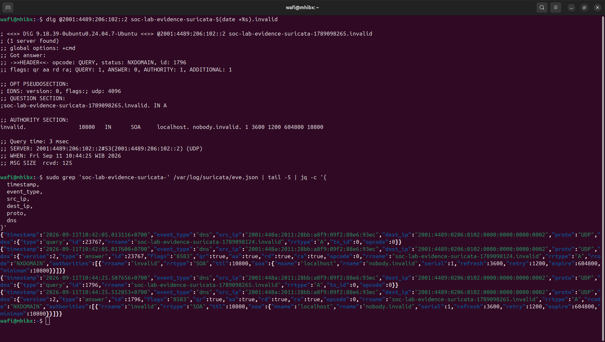
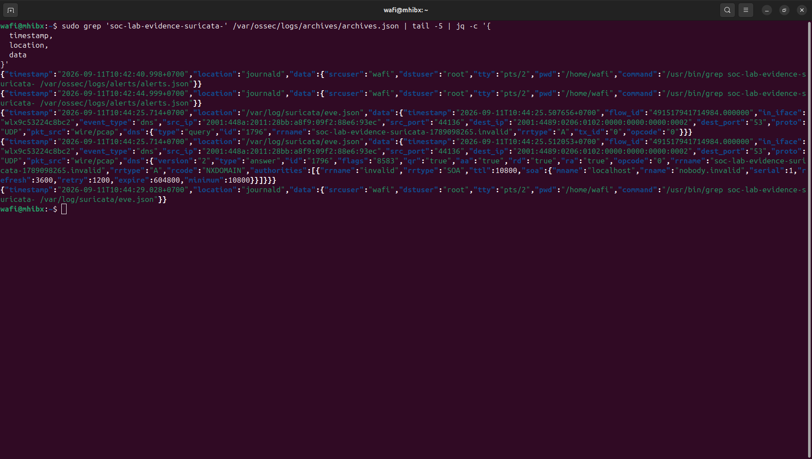
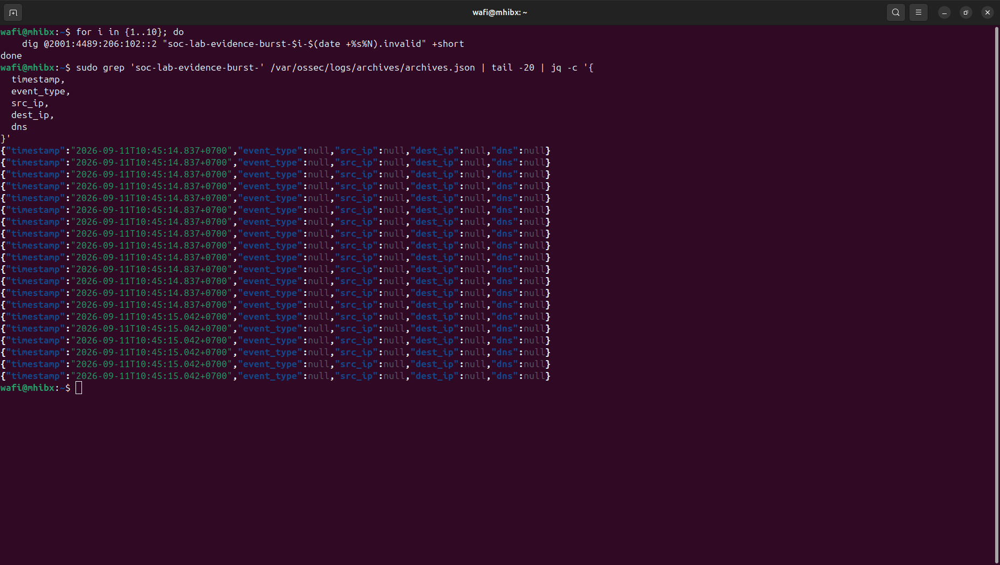
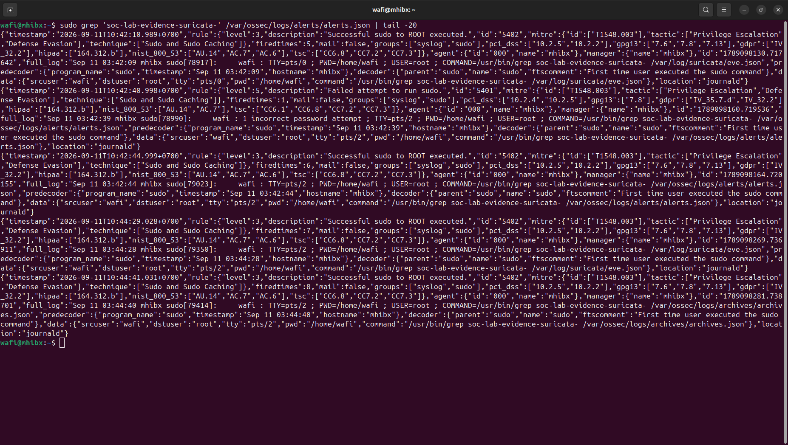

# Incident 08 — DNS Anomaly Investigation

## Overview

This investigation examines DNS behavior in the lab by tracing controlled DNS queries through the monitoring pipeline:

**DNS Query → DNS Response → Suricata Telemetry → Wazuh Ingestion → Alert Evaluation**

The activity includes normal DNS resolution, controlled `NXDOMAIN` queries, and a short burst of unique failed DNS lookups.

The objective is not to treat every `NXDOMAIN` response as malicious, but to understand how DNS activity is observed, ingested, and evaluated by the current detection rules.

---

## Objectives

- Establish a normal DNS resolution baseline.
- Generate controlled `NXDOMAIN` responses.
- Verify that Suricata captures the DNS activity.
- Verify that Wazuh receives the Suricata DNS telemetry.
- Determine whether the activity generates a security alert.
- Compare raw telemetry with detection output.
- Evaluate the risk of simplistic `NXDOMAIN`-based detection.

---

## Lab Environment

| Component | Details |
|---|---|
| Host | Ubuntu 24.04 |
| Wazuh | Wazuh Manager / Dashboard |
| Network IDS | Suricata |
| DNS tool | `dig` |
| Capture interface | `wlx9c53224c8bc2` |
| DNS resolver | `2001:4489:206:102::2` |
| Test domain | `.invalid` TLD |
| Activity type | Controlled DNS investigation |

---

## 1. DNS Baseline

A normal DNS lookup was performed against `github.com`.

The query returned `NOERROR` with an A record response, establishing the expected behavior of a successful DNS resolution.



---

## 2. Controlled NXDOMAIN Simulation

A deliberately nonexistent domain under the reserved `.invalid` TLD was queried:

```bash
dig @2001:4489:206:102::2 soc-lab-nxdomain-20260910.invalid
```

The resolver returned:

```text
status: NXDOMAIN
```

This provides a controlled example of a failed DNS resolution without contacting a real suspicious domain.



---

## 3. Suricata DNS Telemetry

A unique `.invalid` domain was generated specifically for the evidence collection:

```bash
dig @2001:4489:206:102::2 soc-lab-evidence-suricata-$(date +%s).invalid
```

Suricata recorded both the DNS query and the corresponding response.

The telemetry shows:

- `event_type: dns`
- Source IPv6 address
- Destination DNS resolver
- UDP/53
- DNS query name
- `rcode: NXDOMAIN` in the response event



---

## 4. Wazuh Raw Telemetry

The same DNS activity was observed in Wazuh's archived telemetry.

The event was ingested from:

```text
/var/log/suricata/eve.json
```

The archived event contains the Suricata DNS query/response data, including the `.invalid` query and `NXDOMAIN` response.



This confirms the telemetry path:

```text
DNS Activity
     ↓
Suricata
     ↓
eve.json
     ↓
Wazuh
     ↓
archives.json
```

---

## 5. NXDOMAIN Burst

To examine repeated failed DNS resolution, ten unique `.invalid` queries were generated:

```bash
for i in {1..10}; do
    dig @2001:4489:206:102::2 "soc-lab-evidence-burst-$i-$(date +%s%N).invalid" +short
done
```

The resulting DNS activity was subsequently visible in Wazuh archived telemetry.



The use of unique query names avoids relying on a single repeated query and makes the activity easier to identify during investigation.

---

## 6. Alert Evaluation

The burst activity was searched against Wazuh's security alert file:

```bash
sudo grep 'soc-lab-evidence-suricata-' /var/ossec/logs/alerts/alerts.json | tail -20
```

No matching security alert was generated.



This is an intentional finding.

The activity was successfully collected as raw DNS telemetry, but the current Wazuh detection rules did not classify the controlled `NXDOMAIN` activity as a security alert.

---

## Detection Flow

```text
                 Controlled DNS Query
                         │
                         ▼
                 DNS Resolver
                         │
                  NXDOMAIN Response
                         │
                         ▼
                     Suricata
                         │
                    eve.json
                         │
                         ▼
                      Wazuh
                         │
              ┌──────────┴──────────┐
              ▼                     ▼
       Raw Telemetry          Security Alerts
          PRESENT                 NONE
```

---

## Investigation Findings

| Observation | Result |
|---|---|
| Normal DNS resolution | Observed |
| Controlled NXDOMAIN | Observed |
| Suricata DNS telemetry | Observed |
| Wazuh raw telemetry | Observed |
| 10-query NXDOMAIN burst | Observed |
| Matching Wazuh security alert | Not generated |

### Key Finding

The DNS activity successfully traversed the telemetry pipeline from the DNS resolver through Suricata into Wazuh.

However, the current detection configuration did not generate a security alert for the controlled NXDOMAIN burst.

This demonstrates an important distinction between:

- **Telemetry collection** — an event is observed and stored.
- **Detection** — a rule evaluates telemetry and determines whether it should become an alert.
- **Investigation** — an analyst determines whether the observed behavior is meaningful or suspicious.

---

## Detection Engineering Consideration

An alert rule based only on:

```text
NXDOMAIN → ALERT
```

would likely generate unnecessary noise in this environment.

During baseline analysis, other legitimate system and application activity also produced NXDOMAIN responses. Examples included service discovery and package/software-related domains.

Therefore, a more useful detection would require additional context, such as:

- High NXDOMAIN ratio from a single source
- Repeated unique subdomain queries
- Unusual query volume
- Newly observed or suspicious domains
- DNS activity correlated with endpoint or network behavior
- Known malicious indicators

The absence of an alert in this controlled test is therefore not automatically a detection failure. It demonstrates that the current rules do not treat this behavior alone as sufficiently suspicious.

---

## Analyst Assessment

**Classification:** Benign controlled activity

**Risk:** Low

**Disposition:** No escalation

**Containment:** Not required

No evidence of compromise was established by this simulation.

---

## Lessons Learned

1. DNS telemetry can be valuable even when it does not generate an alert.
2. Suricata can provide DNS visibility that can be forwarded into Wazuh.
3. `NXDOMAIN` responses are not inherently malicious.
4. Alert generation depends on detection logic, not simply on telemetry existing.
5. Baseline analysis is important before creating a new detection rule.
6. Repeated DNS failures require contextual analysis rather than a single-event alert.

---

## Evidence

- `dns-baseline.png` — Normal DNS resolution.
- `nxdomain-simulation.png` — Controlled NXDOMAIN response.
- `suricata-dns-nxdomain.png` — Suricata DNS query/response telemetry.
- `wazuh-dns-telemetry.png` — Wazuh archived DNS telemetry.
- `nxdomain-burst-wazuh.png` — Repeated unique NXDOMAIN activity in Wazuh archives.
- `wazuh-no-alert.png` — No matching security alert generated.

---

## Status

**Investigation Completed**
